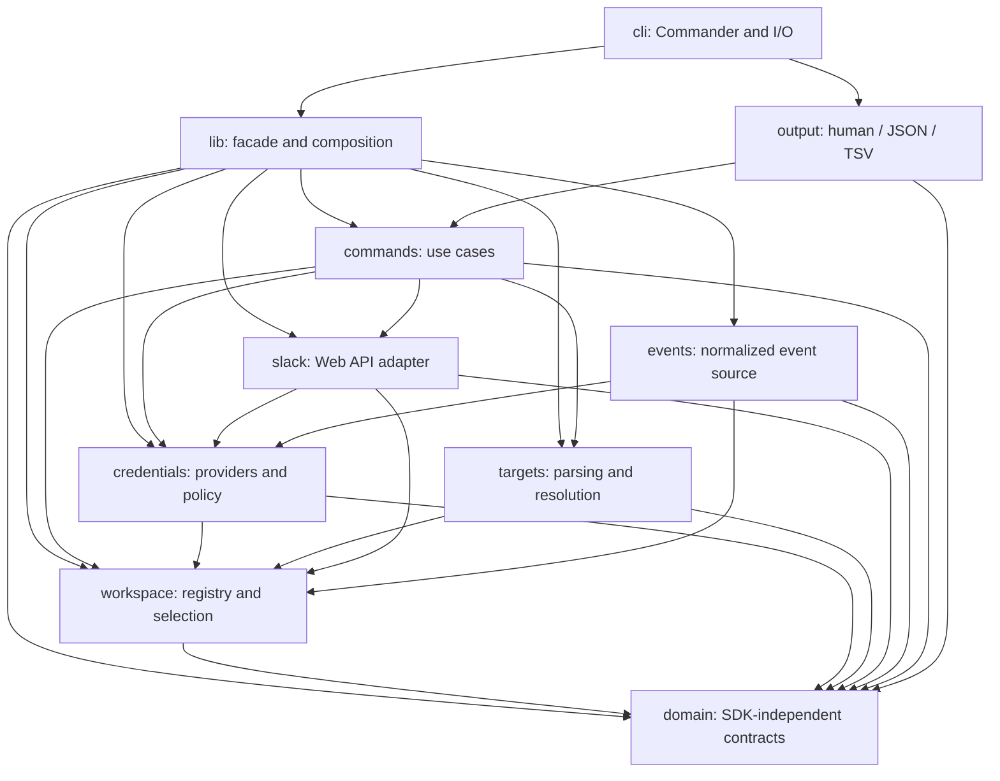
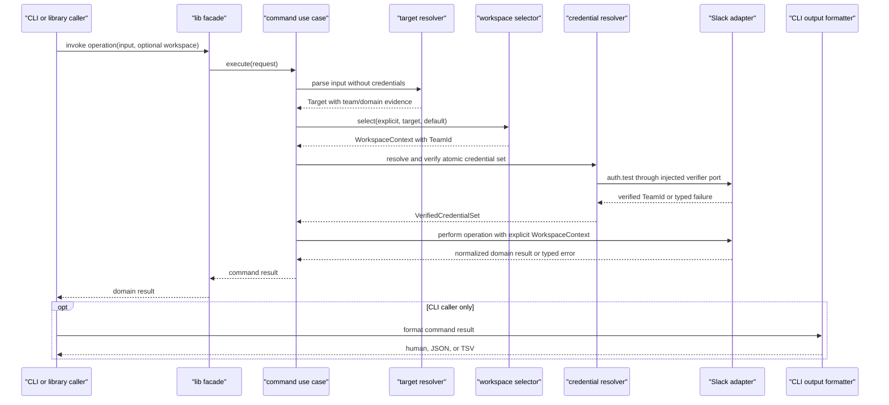
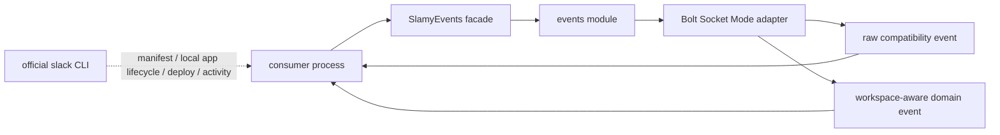

# ADR 002: TypeScript module architecture

- Status: Accepted
- Date: 2026-07-21
- Issue: [#87](https://github.com/tackeyy/slamy/issues/87)
- Parent initiative: [#82](https://github.com/tackeyy/slamy/issues/82)
- Preceded by: [ADR 001](001-official-slack-cli-boundary.md)

## Context

slamy currently ships separate Go and TypeScript CLIs. The TypeScript package is also the npm
library, but its implementation is concentrated in two files:

- `src/cli/index.ts` has 1,006 lines and combines Commander wiring with environment access, target
  adjustment, file and terminal I/O, output formatting, and use-case control.
- `src/lib/client.ts` has 959 lines and combines Slack SDK client creation, User/Bot token fallback,
  API calls, pagination, response mapping, name caches, message policy, file I/O, and timezone
  configuration.

The package exposes only the package root through `package.json#exports`. That root exports
`SlamyClient`, `SlamyEvents`, helpers, options, and slamy-owned result types from
`src/lib/index.ts`. The public contract also includes exported class methods and the generated
declarations reachable from that root. Package-internal deep imports are not supported exports.

The Go CLI has workspace alias selection that the TypeScript CLI does not yet share. The
TypeScript CLI reads token environment variables directly, and `SlamyClient` creates
`@slack/web-api` clients and silently substitutes one token type for another. These constraints
make workspace identity, credential verification, target routing, and command behavior difficult
to test independently.

This ADR defines the target architecture. It does not move source files or claim that the Phase 1
modules are already implemented.

## Decision summary

TypeScript is the single implementation that all slamy CLI and library behavior will converge on.
It remains one npm package and is split internally as a modular monolith. A monorepo or multiple
published packages would add release and compatibility cost without solving a current need.

The target has a dependency-free domain layer, task-oriented commands, replaceable adapters, a
shared library composition root, and a thin CLI. Imports must follow the directed acyclic graph in
this ADR. Slack SDK and Bolt types are converted at adapter boundaries and never appear in public
slamy signatures.

## Target directory structure

```text
src/
  domain/        Slack-SDK- and transport-independent values and contracts
  workspace/     registry, identity, selection, and configuration persistence
  credentials/   credential references, providers, token policy, verification
  targets/       permalink parsing and workspace-aware target resolution
  slack/         Web API ports, SDK adapter, pagination, retry, diagnostics
  commands/      high-level use cases and their port contracts
  output/        human, JSON, and TSV formatters
  events/        normalized event source and Bolt/Socket Mode adapter
  lib/           public API facade and default runtime composition
  cli/           Commander and terminal/file I/O wiring only
```

Tests live beside the module they verify. Cross-module consumer, CLI contract, and architecture
tests may remain under `src/__tests__/`.

## Module responsibilities

| Module | Owns | May import | Must not do |
|---|---|---|---|
| `domain` | `TeamId`, optional `EnterpriseId`, Target values, operation context, result DTOs, typed errors | ECMAScript and TypeScript primitives only | Read configuration, tokens, environment, files, or Slack APIs |
| `workspace` | Registry schema, Team ID identity, alias/domain history, default selection, atomic persistence | `domain` | Store token values, call Slack, or parse command arguments |
| `credentials` | `CredentialRef`, provider interfaces, User/Bot sets, token policy, Team ID verification contract | `domain`, `workspace` | Store plaintext tokens in the registry, silently cross-team fallback, or use the Slack SDK directly |
| `targets` | Slack URL parsing and conversion of channel/message/thread input into a workspace-aware `Target` | `domain`, `workspace` | Read credentials, call Slack, or assign an unknown hostname to the default workspace |
| `slack` | Slack operation ports, `@slack/web-api` adapter, auth verifier, pagination, retry metadata, secret-safe diagnostics, SDK-to-domain mapping | `domain`, `workspace`, `credentials`, `@slack/web-api` | Read global environment, format CLI output, expose SDK response types, or implement a generic API CLI |
| `commands` | Task-oriented read/search/post/reply/reaction/file use cases and orchestration | `domain`, `workspace`, `credentials`, `targets`, `slack` | Import Commander, use `console` or `process`, format output, or expose Slack SDK types |
| `output` | Pure human, JSON, and TSV formatting of command result contracts | `domain`, command result contracts | Select workspaces/tokens or call APIs |
| `events` | Existing raw-event compatibility and an additive workspace-aware event contract; Bolt/Socket Mode adapter | `domain`, `workspace`, `credentials`, `@slack/bolt` | Manage manifests, deployment, official CLI logs, or command execution |
| `lib` | Package-root exports, `SlamyClient`/`SlamyEvents` compatibility facades, default runtime composition | All lower modules except `cli` and `output` | Duplicate use-case behavior or return SDK types |
| `cli` | Commander commands, argument conversion, output selection, exit status, terminal and local-file adapters | `lib`, `output`, `commander`, required Node I/O primitives | Read token/config environment directly, import Slack SDK/Bolt, or implement use cases |

`credentials` owns the auth-verification port; `slack` implements it. Runtime injection lets
credential verification call `auth.test` without a compile-time import from `credentials` back to
`slack`.

The `May import` column lists internal slamy modules. Runtime and platform dependencies are also
restricted by ownership:

- `workspace/node-file-workspace-store.ts` owns Node filesystem, path, permission, and atomic-rename
  operations for the default registry store. The registry service receives the store through an
  interface and remains testable with an in-memory implementation.
- `credentials/environment-credential-provider.ts` is the only default provider that reads token
  environment values. It receives an environment lookup function in tests and never exposes token
  values through formatting or serialization.
- `cli` may use Node terminal and local-file primitives to adapt user input, but it does not read
  registry files or token environment variables. It receives the fully composed runtime from
  `lib`.
- `lib` creates and injects the default Node store, environment provider, target resolver, auth
  verifier, and Slack adapter. Business rules stay in their owning modules.

A general `platform` module is not introduced now. Add one only if at least three modules need the
same platform abstraction and moving it does not weaken the import DAG.

### Contract ownership

- `commands` owns inbound use-case interfaces and operation-specific request/result envelopes.
  Shared identifiers, values, results, and errors belong to `domain`.
- Each capability module owns its outbound contract: workspace registry/selection in `workspace`,
  credential providers and `AuthVerifier` in `credentials`, target resolution in `targets`, and
  Slack operations in `slack`.
- The default adapter lives with the capability contract it implements, except that
  `slack/AuthTestVerifier` implements the `credentials`-owned `AuthVerifier` port.
- `commands` imports these capability contracts and never declares mirror interfaces. Adapters do
  not import `commands` to discover their port types.

## Import direction

An arrow means the source module may import the destination module. Imports in the opposite
direction are forbidden unless another arrow explicitly allows them.



No target-state module may import from `cli`. No module below `lib` may import from `lib`. The
graph must remain acyclic. The first Phase 1 implementation that creates these directories must
add a CI architecture check for cycles and the allow-list above; the check may use a maintained
dependency graph tool or an equivalent repository script. The rule, not a specific tool, is the
contract.

## Command data flow

CLI users and library consumers enter through different adapters but execute the same command use
case.



Workspace selection order is defined by the Target resolver initiative: explicit workspace,
Target Team ID, registered hostname, then default only for input without a URL. Conflicts and
ambiguity fail closed before credentials or Web API calls are attempted.

## Event data flow and official CLI boundary

`SlamyEvents` remains an embeddable event-consumer API. Today it passes Bolt event payload objects
through unchanged after a type cast; the current tests assert that pass-through payload behavior.
During v2, existing event names, `start`/`stop`, and raw pass-through payloads remain
compatible. The target `events` module may add separately named normalized domain events carrying
Team ID evidence, but changing an existing event payload requires contract tests, an additive
transition API, and a documented migration path.



Starting or stopping an embedded receiver is a library runtime concern. App creation, manifest
management, local app orchestration, deployment, activity, and logs remain official `slack` CLI
responsibilities under ADR 001. slamy will not add a competing `run`, deploy, or manifest command.

## Public API and CLI compatibility

The v2 compatibility surface is preserved while internals move behind facades.

| Surface | Migration rule |
|---|---|
| Package root `"."` exports | Existing names remain available throughout v2 |
| `SlamyClient` constructor and methods | Retain as a single-workspace compatibility facade; migrate each method to a shared command use case before removing old logic |
| `SlamyEvents` and event names | Retain as an event facade; preserve `start`/`stop` and existing raw pass-through payload behavior throughout v2; introduce normalized events additively |
| Helper and type exports | Keep signatures additive in v2; move ownership internally without changing the package-root import |
| Slack SDK/Bolt types | Never add to public signatures; map them to slamy-owned domain contracts |
| CLI commands and flags | Preserve current spelling and semantics unless an Issue documents a security-driven fail-closed change and migration path |
| JSON keys and TSV columns | Preserve by default; additive fields require explicit contract tests and release notes |
| stdout, stderr, and exit codes | Treat as agent-facing compatibility contracts and cover with golden tests |
| Package deep imports | Not supported because `package.json#exports` exposes only `"."`; do not add subpath exports during Phase 1 |

Workspace-aware APIs are added without removing the single-workspace facade. Legacy
`SLACK_USER_TOKEN` and `SLACK_BOT_TOKEN` behavior may remain only when no explicit workspace or
registry selection exists. Explicit workspace resolution must never fall back to unrelated legacy
tokens. Legacy environment compatibility is deprecated during v2 and may be removed no earlier
than v3 with a migration guide.

The current User/Bot substitution behavior is not a compatibility guarantee when it conflicts
with token requirements or Team ID safety. Replacing it with a fail-closed error requires contract
tests, release notes, and an actionable error message.

Before a public method migrates, its observable contract must be captured by:

- a consumer compile test against the package root and generated declarations;
- unit tests for inputs, returned domain values, and typed failures;
- CLI golden tests for arguments, JSON/TSV shape, stdout/stderr, and exit status where applicable;
- a mock-port test proving that CLI and library facades call the same use case.

## Independent testability

| Module | Required test seam |
|---|---|
| `domain` | Pure value and error tests |
| `workspace` | Temporary config store and injected filesystem/clock |
| `credentials` | Fake providers and fake auth verifier; secret-leak assertions on every failure |
| `targets` | Table-driven URL fixtures with an in-memory workspace lookup |
| `slack` | Injected mock transport; no live Slack connection in unit tests |
| `commands` | Mock workspace, credential, target, and Slack ports |
| `output` | Pure golden formatting tests |
| `events` | Injected receiver factory, raw pass-through compatibility fixtures, and normalized event fixtures |
| `lib` | Consumer compile and compatibility facade tests |
| `cli` | Spawned-process contract tests with mocked runtime |

## Future extension points

### OAuth and secret providers

The registry stores only an opaque `CredentialRef`. A `CredentialProvider` resolves it to a
short-lived in-memory credential set. Environment variables are the first provider; Keychain or an
OAuth token provider can be added without changing workspace records or command use cases. This
ADR does not introduce an OAuth server, refresh-token store, or interactive login flow.

### Enterprise Grid

Slack Team ID remains the canonical workspace identifier. Optional Enterprise ID is affiliation
metadata, not a replacement primary key. Provider and registry interfaces accept this metadata
without assuming that one enterprise has only one workspace.

### Slack Connect

`Target` keeps execution Team ID and channel ID as separate fields. A hostname, channel ID, or
shared-channel response alone must not be treated as proof of the channel's owning workspace. If
explicit, URL-derived, registry, and API evidence cannot select one execution workspace, the
resolver returns a typed ambiguity result and does not use the default.

## Strangler migration

| Order | Issue or stage | Additive change | Gate before legacy removal |
|---|---|---|---|
| 0 | #87 | Accept this architecture | ADR review, diagrams, compatibility and dependency rules approved |
| 1 | [#84](https://github.com/tackeyy/slamy/issues/84) | Add `domain` and Team ID workspace registry; read legacy Go-style environment configuration through a compatibility adapter | Registry validation, atomic writes, migration policy, architecture CI check |
| 2 | [#86](https://github.com/tackeyy/slamy/issues/86) | Add credential providers, atomic User/Bot sets, the `AuthVerifier` port/policy, and the minimum `slack/AuthTestVerifier` production adapter needed for `auth.test` Team ID validation | Fake-verifier contract tests and real adapter integration tests pass; cross-team and secret-leak tests pass; explicit workspace never uses legacy fallback |
| 3 | [#83](https://github.com/tackeyy/slamy/issues/83) | Add workspace-aware Target parser/resolver | All URL fixtures, conflict cases, Slack Connect ambiguity, and legacy non-URL inputs pass |
| 4 | [#92](https://github.com/tackeyy/slamy/issues/92) | Expand the minimum auth verifier into the complete explicit-context Slack port/adapter and isolate all `@slack/web-api` use | Mock transport, token policy, retained auth hook, pagination, retry, typed-error tests pass |
| 5 | Command migration | Move one vertical command slice at a time; delegate both CLI and `SlamyClient` to the shared use case | Existing and new contract tests pass for each migrated slice; rollback is facade delegation to old code |
| 6 | Output and events | Extract pure formatters and normalized event adapter; keep compatibility facades | CLI goldens and event contract tests pass |
| 7 | Distribution switch | Point npm/global/Homebrew installation and documentation to the TypeScript binary only | Installation smoke tests and migration guide pass; rollback artifact is identified |
| 8 | [#93](https://github.com/tackeyy/slamy/issues/93) | Remove Go source, release, and CI paths | All gates below are satisfied |

Go may be removed only when all of the following are true:

1. Every supported Go command and flag has a TypeScript parity or an approved deprecation.
2. Multi-workspace default, explicit selection, permalink routing, and fail-closed conflicts pass
   end-to-end tests.
3. Package-root consumer compilation and all CLI golden contracts pass.
4. npm/global and Homebrew installations execute the TypeScript binary and pass smoke tests.
5. The migration guide identifies legacy environment changes and the last Go release or tag that
   can be used for rollback.
6. CI no longer needs Go to verify any supported production path.
7. Every production CLI command and corresponding `SlamyClient` method delegates to the shared
   command use case, no duplicate use-case implementation remains in `cli` or `lib`, and the cycle
   and layer architecture checks pass.

## Alternatives considered

### Keep Go and TypeScript as permanent peer implementations

Rejected. Every command, security fix, output contract, and workspace rule would require parity
work and could drift between distributions.

### Split modules into multiple npm packages now

Rejected for now. Separate versioning and publication add operational cost while all modules have
one product owner, one release cadence, and no independent consumer requirement. The internal
boundaries permit a later package split if real consumers require it.

### Wrap or invoke the official Slack CLI

Rejected by ADR 001. slamy needs stable high-level domain contracts and must not depend on another
CLI process or credential store.

## Consequences

### Positive

- Workspace, credentials, targets, output, and transport become independently testable.
- CLI and library behavior converge on one set of use cases.
- SDK major-version changes are contained in the Slack and event adapters.
- Team ID and typed ambiguity keep OAuth, Enterprise Grid, and Slack Connect options open without
  implementing them prematurely.
- Go removal has observable gates and a rollback point.

### Trade-offs

- Compatibility facades temporarily add indirection while old and new implementations coexist.
- Architecture checks and consumer/golden tests add CI maintenance.
- Some current token fallback behavior must be deprecated rather than copied because it conflicts
  with workspace safety.

## Acceptance mapping

| Issue #87 acceptance condition | ADR section |
|---|---|
| Every major component has one responsibility | Module responsibilities |
| Import direction is defined and cycles can be prohibited | Import direction |
| CLI and library cannot duplicate use cases | Decision summary, Command data flow |
| Workspace, credentials, targets, and output can be unit tested | Independent testability |
| Strangler order through Go removal is defined | Strangler migration |
| OAuth, Enterprise Grid, and Slack Connect remain possible | Future extension points |

## References

- [ADR 001: official Slack CLI boundary](001-official-slack-cli-boundary.md)
- [Slack Web API client](https://docs.slack.dev/tools/node-slack-sdk/web-api/)
- [Bolt for JavaScript Socket Mode](https://docs.slack.dev/tools/bolt-js/concepts/socket-mode/)
- [Issue #82: TypeScript replacement initiative](https://github.com/tackeyy/slamy/issues/82)
